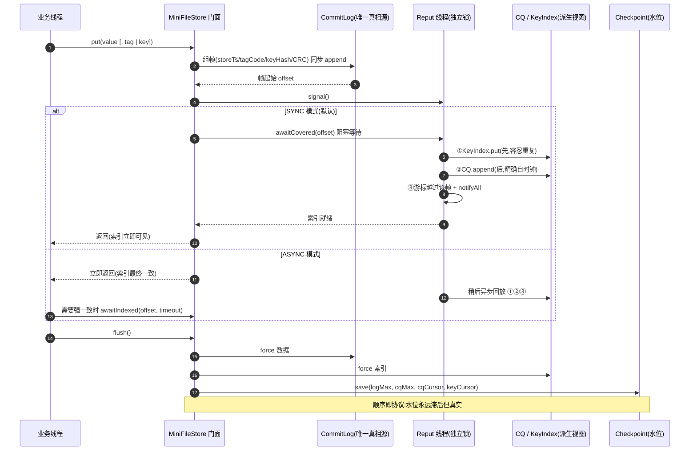
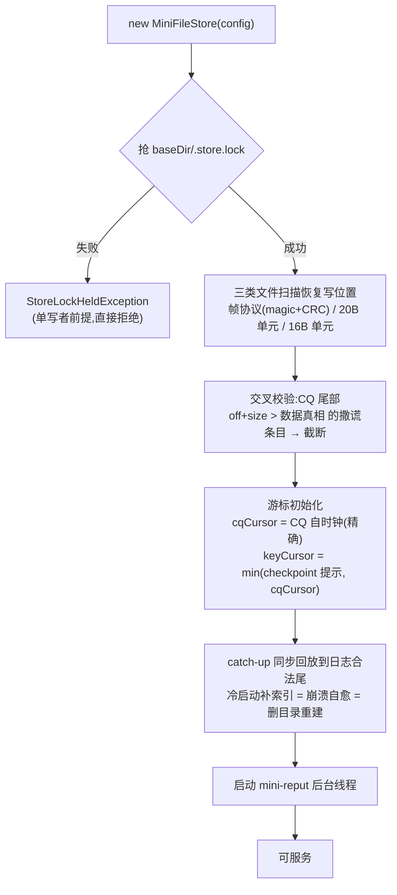

## mini-file-storage:通用嵌入式顺序记录存储引擎

mini-file-storage 是一个 **零第三方依赖(仅 JDK)** 的迷你顺序存储引擎:在 mmap 分段顺序文件之上封装记录格式、逻辑索引、Key 索引与 checkpoint,任何中间件都可以直接嵌入作为存储底座——消息日志、事件溯源、审计流水、简易 KV 皆可。

### 功能一览

| 功能 | 门面入口 |
|------|----------|
| 顺序追加写(mmap 分段文件,自动滚动) | `put(T)` |
| 物理 offset 点读 | `get(offset)` |
| 逻辑位点读取(ConsumeQueue 20 字节定长索引,O(1)) | `getByLogicalIndex(n)` |
| 业务 key 索引写入与查询(KeyIndex,hash 候选) | `put(value, key)` / `getByKey(key)` |
| tagCode 范围查询(默认 tag = 写入时刻,可当时间查询) | `queryByTagRange(begin, end)` |
| 同步/异步刷盘 + checkpoint 落盘 | `flush()` / `StoreConfig.syncFlush` |
| 帧自校验 | magic + CRC32 覆盖帧头与内容,恢复扫描遇撕裂帧/静默损坏必停,读取抛 `StoreCorruptedException` |
| 脏尾清除 | 恢复扫描停止后,停点后 4KB 窗口内的残留字节置零落盘 |
| 进程独占锁 | 同一 `baseDir` 双开直接被 `.store.lock` 拒绝(`StoreLockHeldException`) |
| Reput 异步索引 | put 只写 CommitLog,ConsumeQueue/KeyIndex 由后台线程按帧头回放构建 |
| 一致性分级 | `IndexMode.SYNC`(默认,put 等索引追平)/ `ASYNC`(最终一致 + `awaitIndexed` 显式升级) |
| 重启恢复(CommitLog / ConsumeQueue / KeyIndex 均扫描恢复追加位置) | 相同 `StoreConfig` 重新打开 |
| 索引可重建不变式 | 删除索引目录与 checkpoint 后重开,全部查询结果自动恢复(由启动 catch-up 回放) |

### 快速开始(门面 API)

```java
StoreConfig config = StoreConfig.builder("./data/demo").build();
FileStore<LogRecord> store = new MiniFileStore<>(config, new LogRecordCodec());

long now = System.currentTimeMillis();
long offset = store.put(new LogRecord(now, "INFO", "hello"));   // 泛型记录,任意业务对象
LogRecord r1 = store.get(offset);                               // 按物理 offset 读
LogRecord r2 = store.getByLogicalIndex(0);                      // 按逻辑位点读
store.put(new LogRecord(now, "INFO", "order-1-body"), "order-1"); // 带业务 key 索引
List<LogRecord> hits = store.getByKey("order-1");
List<LogRecord> recent = store.queryByTagRange(now - 60_000, now);

store.flush();
store.close();
```

对象与字节的互转通过 `Codec<T>` 注入(内置 `LogRecordCodec` 示例)。默认 `SYNC` 模式下 put 返回即索引可见;吞吐优先可用 `indexMode(ASYNC)` + `awaitIndexed` 显式控制一致性(见下文"整体流程图 → 一致性速查")。完整行为参考单元测试 `MiniFileStoreTest` / `ReputConsistencyTest`。

以下章节展开磁盘格式与内部机制,用于理解门面背后的实现。本工程最初是一组演示:

- 如何基于 mmap 管理多段顺序文件;
- 如何在物理日志之上封装“记录格式”;
- 如何用一个固定长度的逻辑索引（ConsumeQueue）实现按逻辑 offset 访问;
- 如何用一个简单的 KeyIndex 文件按 key 查询;
- 如何用 checkpoint 记录刷盘位置，并在重启时做最基本的恢复。

---

## 整体流程图（Reput 异步模型）

### 写路径:一次 put 的旅程



### 启动路径:打开即自愈



### 一致性速查

| 读方法 | SYNC(默认) | ASYNC |
|---|---|---|
| `get(offset)` 物理点读 | 强一致 | 强一致(只碰真相源) |
| `getByLogicalIndex` / `getByKey` / `queryByTagRange` | 强一致(put 已等) | 最终一致,`awaitIndexed` 升级 |

> **可重建不变式**(有专门测试):删除 `consumequeue/`、`keyindex/` 与 checkpoint 文件,重开后全部索引查询结果与删除前一致——索引是缓存,CommitLog 才是本体。

---

## 一、文件与协议格式（按组件）

### 1. CommitLog：物理日志文件

- 对应类：
  - [MmapSequentialLog]
  - [SimpleMappedFileQueue]
  - [SimpleMappedFile]
  - [RecordStore]
  - RecordFrame（帧编解码，格式知识的唯一来源）
- 目录与文件名：

| 维度       | 说明                                                                 |
|------------|----------------------------------------------------------------------|
| 目录       | 由 `SequentialLogConfig.storePath` 决定，例如 `./docs/mini-file-storage-data-test` |
| 单文件大小 | `SequentialLogConfig.fileSize`，例如 8MB                            |
| 文件命名   | `SimpleMappedFileQueue.formatFileName` 使用 `%020d` 格式化起始偏移，如 `00000000000000000000` |
| 起始偏移   | 文件名对应的 long 值，即该文件覆盖的 CommitLog 起始物理 offset          |

- 记录格式（RecordStore 视角，**格式 v2**）：

磁盘单元不再是裸 `[length][payload]`，而是**自校验帧**（`core/RecordFrame`，全部大端）：

| 偏移 | 长度 | 字段             | 说明                                          |
|------|------|------------------|-----------------------------------------------|
| 0    | 4    | magic            | `0x484F544B`（"HOTK"），兼作格式版本标识       |
| 4    | 4    | bodyLen          | Codec 编码后的 payload 字节数                  |
| 8    | 8    | storeTimestamp   | 引擎盖章的写入时间（服务端接收语义）            |
| 16   | 8    | tagCode          | 业务 tag，与写入 ConsumeQueue 的值同源          |
| 24   | 8    | keyHash          | 业务 key 的 32 位 hash（0 = 无 key）            |
| 32   | 4    | bodyCRC          | CRC32，覆盖 `magic..keyHash` 与 body，不含自身 |
| 36   | var  | body             | 编码后的业务对象（示例为 LogRecord）            |

帧总长 = 36 + bodyLen。`put(v, key)` 时 keyHash 随帧头落入 CommitLog——索引所需信息全部在日志里，ConsumeQueue / KeyIndex 因此原则上可由日志重建（唯一真相源）。

> ⚠️ v2 与旧版 `[4B length][payload]` 二进制不兼容：旧数据开头读不到 magic，会被视为空洞从头覆盖。升级前清空旧数据目录。

- 单个文件恢复协议（`SimpleMappedFile.recoverRecordStoreWrotePosition`）：

| 步骤 | 条件                                                | 行为                                              |
|------|-----------------------------------------------------|---------------------------------------------------|
| 1    | 从停点起剩余不足 36B，或 magic 不符                  | 判为帧边界终止，停止扫描（NOT_MATCHED）             |
| 2    | `bodyLen` 为负或超出文件剩余                         | 脏长度值，停止扫描（NOT_MATCHED）                   |
| 3    | 重算 CRC 与帧内 bodyCRC 不一致                       | **内容撕裂/静默损坏，停止扫描（CORRUPTED）**        |
| 4    | 全部通过                                             | position 前移 `36 + bodyLen`，继续下一帧            |
| 5    | 扫描结束                                             | 停点即 `wrotePosition` / `flushedPosition`          |
| 6    | 停点后 4KB 窗口内存在非零字节                        | **脏尾置零并立即 force**，不留残余                  |

**为什么必须有帧头 CRC**：mmap 写回以 4KB 页为单位、页间无顺序保证，`force()`（≈ msync）同样不保证文件内页序——一条跨页记录在断电后可能"头部页已落、体部页丢失"。v1 只校验 length，面对这种"结构合法的坏数据"会静默越过；v2 用 magic+CRC 把判定从"结构像不像"升级为"内容对不对"，恢复必停在损坏帧之前。同一校验在 `read()` 路径复用，盘上静默损坏（bit rot）也会被立即发现并抛 `StoreCorruptedException`。

---

### 2. LogRecord：业务对象编码格式

- 对应类：
  - [LogRecord]
  - [LogRecordCodec]
- 字段：

| 字段       | 类型    | 含义     |
|------------|---------|----------|
| timestamp  | long    | 时间戳   |
| level      | String  | 日志级别 |
| message    | String  | 日志内容 |

- 编码协议（`LogRecordCodec.encode`）：

| 顺序 | 字段             | 长度（字节）    | 类型                     | 说明                             |
|------|------------------|-----------------|--------------------------|----------------------------------|
| 1    | timestamp        | 8               | long                     | 记录时间                         |
| 2    | levelLength      | 4               | int                      | level 的 UTF-8 字节长度          |
| 3    | levelBytes       | levelLength     | bytes (UTF-8)            | level 内容                       |
| 4    | messageLength    | 4               | int                      | message 的 UTF-8 字节长度        |
| 5    | messageBytes     | messageLength   | bytes (UTF-8)            | message 内容                     |

整个 payload 长度为上述字段总和，对应 `RecordStore` 中的 `payload`。

---

### 3. ConsumeQueue：逻辑消费队列索引

- 对应类：
  - [SimpleConsumeQueue]
  - [SimpleIndexEntry]

- 目录与文件名：

| 维度       | 说明                                                                 |
|------------|----------------------------------------------------------------------|
| 目录       | 由构造函数参数 `storePath` 决定，例如 `./docs/mini-file-storage-cq-test`    |
| 单文件大小 | 由构造函数参数 `mappedFileSize` 决定，运行时会向下对齐为 `CQ_STORE_UNIT_SIZE` 的整数倍 |
| 文件命名   | 与 CommitLog 相同，用 `%020d` 格式化起始“索引文件内偏移”             |
| 起始偏移   | 文件名对应的 long 值，表示该索引文件覆盖的索引字节起始位置           |

- 每条索引 entry 协议（固定 20 字节）：

| 顺序 | 字段           | 长度（字节） | 类型  | 说明                                          |
|------|----------------|--------------|-------|-----------------------------------------------|
| 1    | physicalOffset | 8            | long  | 对应 CommitLog 中记录的起始物理 offset        |
| 2    | size           | 4            | int   | 该记录在 CommitLog 中占用的帧总长（36B 帧头 + body） |
| 3    | tagCode        | 8            | long  | mini 实现中直接存放 timestamp，用于时间查询   |

- 逻辑 offset → 索引映射：

| 逻辑 offset | 对应索引文件内偏移                      |
|-------------|-----------------------------------------|
| `n`         | `offsetInIndexFile = n * CQ_STORE_UNIT_SIZE` |

通过 `SimpleConsumeQueue.get(logicalOffset)`：

1. 计算 `offsetInIndexFile`；
2. 通过 `SimpleMappedFileQueue.findMappedFileByOffset` 找到具体文件；
3. 在文件内按 `[8 offset][4 size][8 tagCode]` 读取一条索引；
4. 若 `physicalOffset < 0` 或 `size <= 0`，视为无效，返回 null。

- 单个索引文件恢复协议（`SimpleMappedFile.recoverConsumeQueueWrotePosition`）：

| 步骤 | 条件                                      | 行为                                                      |
|------|-------------------------------------------|-----------------------------------------------------------|
| 1    | 从文件头开始，每次按 20 字节读取          | 若剩余空间不足 20 字节，则停止                            |
| 2    | 读取 `physicalOffset`、`size`             | 若 `physicalOffset < 0` 或 `size <= 0`，则停止            |
| 3    | 否则                                      | 将 position 前移 20 字节，继续下一条                      |
| 4    | 扫描结束                                  | 将最后一个合法位置设置为 `wrotePosition` 与 `flushedPosition` |

---

### 4. KeyIndexFile：按 keyHash 查找物理 offset

- 对应类：
  - [KeyIndexFile]

- 目录与文件名：

| 维度       | 说明                                                                |
|------------|---------------------------------------------------------------------|
| 目录       | 由构造函数参数 `storePath` 决定，例如 `./docs/mini-file-storage-key-index-test` |
| 单文件大小 | 构造函数参数 `fileSize`，例如 1MB                                   |
| 文件命名   | 同样用 `%020d` 表示起始索引字节偏移                                   |

- 每条索引 entry 协议（固定 16 字节）：

| 顺序 | 字段        | 长度（字节） | 类型  | 说明                             |
|------|-------------|--------------|-------|----------------------------------|
| 1    | keyHash     | 8            | long  | 业务 key 的 hash                 |
| 2    | physicalOffset | 8         | long  | 对应 CommitLog 中记录的物理 offset |

- 读取逻辑（`KeyIndexFile.get`）：

| 步骤 | 描述                                           |
|------|------------------------------------------------|
| 1    | 从 logicalIndex = 0 开始，每次偏移 `INDEX_UNIT_SIZE` |
| 2    | 用 `findMappedFileByOffset` 找到所在文件        |
| 3    | 读取一条 `[keyHash][physicalOffset]`           |
| 4    | 如果 storedKeyHash == 目标 keyHash，则加入结果  |
| 5    | 文件队列找不到映射文件时停止扫描               |

这里是最简单的顺序扫全表实现，没有 hash 槽，也没有头部元数据。

---

### 5. StoreCheckpoint：水位检查点（v2 双槽原子）

- 对应类：
  - `store.StoreCheckpoint`（独立类；v1 为 RecordStore 内部类，已废弃）

- 文件格式：**两个 44 字节槽交替覆写**（文件固定 88 字节），单槽布局：

| 偏移 | 长度 | 字段          | 说明                                        |
|------|------|---------------|---------------------------------------------|
| 0    | 4    | magic         | `0x43503201`（"CP2"），旧 16B 格式无 magic 视为不可用 |
| 4    | 4    | seq           | 单调递增；save 写"落后槽"，seq = max+1       |
| 8    | 8    | logFlushMax   | CommitLog 已 flush 的最大物理 offset          |
| 16   | 8    | cqFlushMax    | CQ 文件已 flush 字节位点（-1 = 无 CQ）        |
| 24   | 8    | cqCursor      | Reput 已建索引到的日志位点（-1 = 不适用）      |
| 32   | 8    | keyCursor     | Reput 已建 KeyIndex 到的位点（-1 = 不适用）    |
| 40   | 4    | crc           | 覆盖前 40 字节                                |

- **为什么要双槽**：v1 的 16B 原地覆写切在断电中间会产出"每个字段都合法、组合却是假的"的杂交水位——这也是 v1 时代 checkpoint 不敢被恢复消费的原因。双槽交替保证任何时刻至少一槽完整，`load()` 校验 magic+CRC 后取 seq 大的槽；两槽全坏返回 null，调用方退化为"文件自推导"。
- **消费方**：启动时 `keyCursor` 提示 Reput 从哪续（与 CQ 自时钟取 min，重叠区靠读去重消化）；`logFlushMax` 保留给未来的"checkpoint 驱动扫描起点"（当前恢复仍全量扫，属已知成本）。
- 不变式由写入顺序保证：**checkpoint ≤ 索引 ≤ 数据**（flush 按此顺序 force，水位最后写），水位永远"滞后但真实"。

---

## 二、生命周期与调用链路（Reput 异步模型）

### 1. 启动阶段（门面模式，`new MiniFileStore<>(config, codec)`）

1. **抢进程锁**：`baseDir/.store.lock` `tryLock`，失败抛 `StoreLockHeldException`——单写者前提从此有人守；
2. **三类文件扫描恢复**：CommitLog 按帧协议（含脏尾置零）、ConsumeQueue 按 20B 单元、KeyIndex 按 16B 单元；
3. **交叉校验**：`cq.truncateBeyond(log.maxOffset)` 从尾部弹掉"指向未落盘数据"的撒谎索引条目（断电时设备可能乱序落盘，CQ 页留下而数据页丢失是真实场景）；
4. **游标初始化**：`cqCursor` 取 CQ 自时钟（最后条目的 off+size，精确）；`keyCursor` 取 `min(checkpoint 提示, cqCursor)`（保守下界）；
5. **catch-up 同步回放**：Reput 从游标追到日志合法尾——**冷启动补索引、崩溃自愈、删索引目录后全量重建共用这一段代码**；
6. 启动后台 `mini-reput` 线程（daemon）。

> legacy 手工装配路径（`FileDemoTest` 直接 new 组件、`RecordStore` 内联写 CQ）仍保留，标记 @Deprecated；新代码一律走门面。

### 2. 写入链路（put 只碰真相源）

1. `put(value[, tag|key])` → `RecordStore.append`：encode body → `RecordFrame.encode` 盖 storeTimestamp/tagCode/keyHash/CRC → `log.append` 写 CommitLog → 返回帧起始 offset；
2. `reput.signal()` 唤醒后台线程；
3. **SYNC（默认）**：put 内 `awaitCovered(offset)` 等本帧索引建完才返回——对外强一致，但索引写已移出用户线程的关键路径；
   **ASYNC**：立即返回，索引读需 `awaitIndexed(offset, timeout)` 显式升级；
4. Reput 对每帧固定顺序：**① keyHash≠0 先 KeyIndex.put → ② 后 CQ.append → ③ 游标推进 + notify**。顺序不可反：CQ 是精确自时钟，必须最后写——否则断点会留下"CQ 已越过、key 永久缺失"的缺口；按此顺序最坏只产生 key 重复，读侧去重消化；
5. `flush()` 按**数据 → 索引 → 水位**顺序 force 并 `checkpoint.save(4 水位)`（checkpoint 写最后 ⇒ 只保守不超前）。

### 3. 查询链路

- `get(offset)`：CommitLog 帧头 → bodyLen → 整帧 → magic+CRC 校验 → decode。只读真相源，**任何模式强一致**；
- `getByLogicalIndex(n)`：CQ `n×20` 定位 → 回表 get（ASYNC 下最终一致，或先 await）；
- `queryByTagRange(b,e)`：顺序扫 CQ tagCode，`<b` 跳过、`>e` 截断（依赖 tag 单调写入的前提）；
- `getByKey(key)`：KeyIndex 全表扫 hash 命中 offset 集合 → **LinkedHashSet 去重**（回放重叠产物）→ 逐个回表；语义是候选集，hash 冲突需业务自校验。

### 4. 关闭与重启

- `close()`：`reput.stopAndDrain()`（停线程 + 调用线程收尾回放到最新）→ `flushAll()` → 关 CQ/KeyIndex/日志组件 → 释放进程锁。**ASYNC 下 close 保证不欠账**（有回归测试）；
- 重启：见"启动阶段"五步——同一套扫描+校验+catch-up,任意断点对恢复都是安全的。

---

## 三、各文件协议一览表（汇总）

| 文件类型        | 单条记录/entry 协议                                                |
|-----------------|---------------------------------------------------------------------|
| CommitLog       | `[36B 帧头(magic/bodyLen/storeTs/tagCode/keyHash/CRC)][body]`        |
| LogRecord payload | `[8 ts][4 levelLen][levelBytes][4 msgLen][msgBytes]`            |
| ConsumeQueue    | `[8 physicalOffset][4 size][8 tagCode]`（size=帧总长）               |
| KeyIndexFile    | `[8 keyHash][8 physicalOffset]`                                     |
| StoreCheckpoint | 88B 双槽文件，每槽 `[magic][seq][4×水位][crc]`（v2 原子交替）        |
| .store.lock     | 空文件，仅作进程独占锚（内容无意义，永不删除）                       |

---

## 四、与 RocketMQ 存储的对比与待改进点

本 mini 只实现了 RocketMQ 存储中的“骨架”，很多地方是刻意简化的。下面按能力维度列出对比和可以改进的方向。

### 1. 记录格式与校验

| 维度           | mini 实现                                           | RocketMQ 真实实现（目标方向）                              | 可改进点                                       |
|----------------|-----------------------------------------------------|------------------------------------------------------------|------------------------------------------------|
| CommitLog 条目 | v2 帧头含 magic+storeTs+tagCode+keyHash，CRC 覆盖头体，结构+内容双校验 | 头部包含 magic、crc、flag、时间戳等，严格校验长度和 CRC     | ✅ 已对齐核心思路（flag/主题等字段仍缺，按需再加）              |
| 业务 payload   | LogRecordCodec 自定义结构                           | MessageExtStorage 结构更复杂，含 topic、queueId、flag 等   | 在 mini 中增加 topic、queueId 等，模拟多队列场景 |
| 索引 entry 校验 | ConsumeQueue 只校验 `offset >= 0 && size > 0`       | 还会校验 `offset + size <= commitLogMaxOffset`            | 在恢复时增加与 CommitLog 的交叉校验             |

### 2. 恢复与重建

| 能力         | mini 实现                                                   | RocketMQ 真实实现                                        | 可改进点                                                         |
|--------------|-------------------------------------------------------------|----------------------------------------------------------|------------------------------------------------------------------|
| CommitLog 恢复 | 逐文件按帧协议扫描，magic/bodyLen/CRC 任一不过即停，脏尾置零清除            | 从 checkpoint 起步，按完整消息结构解析，严格截断尾部    | 利用 checkpoint 的 commitLog 偏移缩小扫描范围                    |
| ConsumeQueue 恢复 | 只根据自身结构校验 `[offset][size][tagCode]`             | 额外校验 offset 是否落在 CommitLog 合法范围内          | 增加 `offset + size <= commitLogMaxOffset` 的校验                |
| 索引重建     | 无自动重建逻辑，业务可以手工重跑写入代码                  | 通过 Reput 服务从 CommitLog 回放，自动重建 ConsumeQueue 与 IndexFile | 在 mini 中增加一个简单的“重放线程/方法”，按 CommitLog 顺序重放   |
| IndexFile 恢复 | 按 16 字节单元顺序扫描恢复追加位置(全零空洞即停);尚无头部元数据与校验 | 读取头部元数据，检查槽位/entry 是否合理，必要时截断或删除 | 为 KeyIndexFile 增加头部和简单的损坏检测策略                    |

### 3. 索引能力

| 维度         | mini 实现                                         | RocketMQ 真实实现                                             | 可改进点                                             |
|--------------|---------------------------------------------------|---------------------------------------------------------------|------------------------------------------------------|
| ConsumeQueue | 单一队列，逻辑 offset = 行号                      | 多 Topic、多 QueueId，按 Topic.QueueId 维护多条 ConsumeQueue | 在 mini 中加入“逻辑队列类型/ID”字段，模拟多队列     |
| Key 索引     | 顺序扫全表，`keyHash -> 多个 physicalOffset`      | 基于 hash 槽 + 冲突链的倒排索引，带时间范围过滤              | 为 KeyIndexFile 增加 slot 区域和简单的 hash 冲突链  |
| 时间查询     | 依赖 ConsumeQueue 中的 tagCode = timestamp        | 结合文件时间、ConsumeQueue、IndexFile 多层过滤               | 在 mini 中模拟按时间段定位 CommitLog 起始文件的逻辑 |

### 4. 刷盘与性能

| 维度           | mini 实现                                  | RocketMQ 真实实现                            | 可改进点                                           |
|----------------|--------------------------------------------|----------------------------------------------|----------------------------------------------------|
| 刷盘策略       | `SequentialLogConfig.isSyncFlush`，要么同步要么简单异步 | 同步/异步刷盘，单独的 flush/commit 线程      | 将 flush 抽成单独线程，模拟高吞吐异步 flush 情况  |
| Page Cache 利用 | 使用 mmap，简化版实现                      | 同样大量使用 mmap 和 Page Cache              | 增加写入压力测试，观察 flush 策略对延迟的影响       |
| 零拷贝发送     | 未实现                                     | 发送时使用 FileRegion/sendfile 等            | 在 mini 的“读取/发送”路径中模拟直接从文件到 socket |

---

## 五、如何阅读和扩展本 mini

建议的阅读顺序：

1. 看协议表格（本 README 第一、三部分），脑中先有“磁盘上到底长什么样”；
2. 看核心类：
   - [SimpleMappedFileQueue]
   - [RecordStore]
   - [SimpleConsumeQueue]
   - [KeyIndexFile]
3. 跑一遍单测 [FileDemoTest]，尤其是：
   - 物理/逻辑 offset 读取；
   - 时间范围查询；
   - key 查询；
   - 重启恢复场景。
4. 对照"待改进点"表格动手增强，当前状态一览：
   - ~~为记录增加 CRC 和魔数~~（已实现：帧格式 v2）；
   - ~~Reput 回放重建索引~~（已实现：`ReputService` + 启动 catch-up，删索引目录可重建）；
   - ~~Checkpoint 双槽原子 + 被启动流程消费~~（已实现：v2 四水位；剩余——用 `logFlushMax` 缩小数据扫描起点）；
   - 待做：ConsumeQueue 恢复时的帧级 CRC 全量交叉校验（当前只做尾部截断）；
   - 待做：KeyIndexFile hash 槽结构（替代线性扫描）；
   - 待做：独立 FlushService 异步刷盘线程、过期文件删除与磁盘水位、munmap。

这样，这个 mini 就不仅仅是“能跑的 demo”，而是你可以不断对标 RocketMQ 存储实现、逐步演进的实验场。

> 历史备注：本节曾整段描述"未来的 Checkpoint/Reput 服务应该怎么做"。该设计已在
> `store/ReputService` + `store/StoreCheckpoint(v2)` 落地——启动生命周期与写入顺序见
> "整体流程图"与"二、生命周期与调用链路"两节，原文不再保留以免误导。

---

## 四、RocketMQ 与 mini-file-storage mini 对比表

下面用一个表格对比 RocketMQ 真实实现和本 demo mini 实现的关系，方便对号入座：

| 维度/特性                  | RocketMQ                                                   | mini-file-storage mini 实现                                                                |
|---------------------------|------------------------------------------------------------|------------------------------------------------------------------------------------|
| 物理存储                  | CommitLog 多文件队列（MappedFileQueue）                   | `MmapSequentialLog` + `SimpleMappedFileQueue`                                      |
| 单文件管理                | 固定大小，文件名为起始 offset，滚动创建                   | 同样：固定大小文件，文件名为起始 offset，滚动创建                                  |
| 消息物理格式              | 头 + 体，包含多种字段（魔数、CRC、主题、队列 ID 等）      | v2 帧头：magic + storeTs + tagCode + keyHash + CRC + body                          |
| 多 Topic/Queue 支持       | 所有消息写同一 CommitLog；按 Topic.Queue 维护 ConsumeQueue | 只做“单队列”模型，但 ConsumeQueue 结构与 RocketMQ 类似                            |
| 逻辑队列索引结构          | ConsumeQueue：20 字节 `[offset][size][tagCode]`           | `SimpleConsumeQueue`：20 字节结构完全对齐                                          |
| 按 Topic.Queue + offset 读 | 逻辑 offset → ConsumeQueue → CommitLog                    | `readByLogicalOffset` → `SimpleConsumeQueue` → `RecordStore.read`                  |
| 按时间查询                | 结合 CommitLog 时间戳、文件名、tagCode/IndexFile          | 使用 `SimpleConsumeQueue` 的 tagCode 存时间戳，`queryByTimeRange` 顺序过滤         |
| 按 key 查询               | IndexFile：hash 槽 + index entry 结构                     | 简化 `KeyIndexFile`：顺序存储 `[keyHash][physicalOffset]`，线性扫描                |
| 刷盘策略                  | 同步/异步刷盘，多线程 flush/commit                        | `flush()` 数据→索引→水位顺序 force，支持配置 syncFlush；独立 FlushService 未做     |
| 索引构建                  | put 只写 CommitLog，Reput 线程回放构建 ConsumeQueue/IndexFile | ✅ 同模型：put 只写日志，`ReputService` 回放帧头构建 CQ/KeyIndex；SYNC/ASYNC 一致性分级 |
| 宕机恢复                  | CommitLog 扫描 + ConsumeQueue 校验/截断 + Reput 重建索引  | 帧协议扫描(含脏尾清除) + CQ 交叉校验截断 + catch-up 回放重建，删索引目录可全量重建   |
| Checkpoint                | 独立 Checkpoint 文件记录多组件刷盘时间                    | v2 双槽原子(4水位+seq+CRC)；keyCursor 提示已消费，logFlushMax 驱动扫描起点为剩余工作 |
| 磁盘空间回收              | 定时删除过期 CommitLog/ConsumeQueue/IndexFile             | 未实现，只关注写入/读取和索引逻辑                                                  |
| HA 与多副本               | 主从同步 CommitLog，支持高可用                            | 未实现                                                                             |
| 事务、重试、顺序消息等    | 上层协议和存储配合实现                                    | 未实现，聚焦底层存储原理                                                          |
| 实现复杂度                | 完整生产级实现，代码量大                                  | 核心逻辑浓缩到少量类，适合学习和实验                                               |

可以简单理解为：**mini-file-storage 把 RocketMQ 存储里的“CommitLog + ConsumeQueue + KeyIndex + Checkpoint”抽出一个最小可运行子集，用来演示顺序写、索引和恢复的基本思路**。

---

## 五、Demo 入口与运行方式

### 1. Demo 入口（手动运行）

- 行为：
  - 构造 `SequentialLogConfig` 和 `MmapSequentialLog`；
  - 构造 `RecordStore<LogRecord>` 和 `LogRecordCodec`；
  - 写入若干条 `LogRecord`，记录每条的起始物理 offset；
  - 使用 `SimpleConsumeQueue` 维护逻辑 offset 索引；
  - 可选地使用 `KeyIndexFile` 维护 key → offset 索引；
  - 调用 `store.flush()` 和 `keyIndexFile.flush()` 刷盘；
  - 再根据物理 offset、逻辑 offset、时间范围、key 等方式读回，并打印到控制台。

推荐直接通过门面 `MiniFileStore`（见开头“快速开始”）走通以上全部行为，参考单元测试
`com.ispengya.file.MiniFileStoreTest`。

### 2. 单元测试（推荐阅读）

- 测试类：`com.ispengya.file.FileDemoTest` 与门面测试 `com.ispengya.file.MiniFileStoreTest`
- 所在目录：`src/test/java/com/ispengya/file/`
- 覆盖内容包括：
  - `testAppendAndReadByPhysicalOffset`：验证物理 offset 读写；
  - `testReadByLogicalOffset`：验证通过 ConsumeQueue 的逻辑 offset 读取；
  - `testQueryByTimeRange`：验证按时间范围查询；
  - `testKeyIndexQuery`：验证按 key 查询；
  - `testCheckpointWrittenOnFlush`：验证 flush 时 checkpoint 正确写入；
  - `testRecoverCommitLogAfterRestart`：验证 CommitLog 基于文件扫描的启动恢复；
  - `testRecoverConsumeQueueAfterRestart`：验证 ConsumeQueue 启动恢复后在旧索引后继续追加并按逻辑 offset 读取；
  - `MiniFileStoreTest#restartRecoveryKeepsAllIndexTypes`：验证三类文件(数据/CQ/KeyIndex)重启后均可继续追加与读取。
- 可靠性与异步测试（本次重构新增）：
  - `CommitLogCorruptionTest`：撕裂帧恢复停位 / 读损坏抛错 / 双开拒绝 / 脏尾清零；
  - `RebuildInvariantTest`：**删除 CQ/KeyIndex 目录与 checkpoint 后重开，全部索引查询自动重建一致**（唯一真相源契约）；
  - `ReputServiceTest` / `ReputConsistencyTest`：回放顺序、awaitCovered 语义、close drain 不欠账、getByKey 去重；
  - `ReputCheckpointTest` / `RecordFrameTest`：双槽原子、帧编解码三态判定。

在模块根目录执行：

```bash
cd mini-file-storage
mvn test
```

可以一次性跑完所有测试，帮助你从测试用例的角度理解整个 mini 存储引擎的行为。  

---

## 六、整体流程调用图（循序渐进）

这一节用纯文本画出几条关键调用链，并给出一个推荐的阅读顺序，方便从“概念 → mini 设计 → 实际调用路径 → 恢复流程”循序渐进地理解。

### 1. 推荐阅读顺序

- 第一步：先阅读“RocketMQ 底层存储整体设计概览”，掌握 CommitLog / ConsumeQueue / IndexFile / Checkpoint / Reput 的整体关系；
- 第二步：再看“mini-file-storage mini 存储引擎设计”，对照 RocketMQ 概念理解 `MmapSequentialLog`、`RecordStore`、`SimpleConsumeQueue`、`KeyIndexFile` 各自的职责；
- 第三步：结合下面的“写入 / 读取 / 启动恢复 / 重放”流程图，建立模块之间的调用图像；
- 第四步：最后对照 `FileDemoTest` / `MiniFileStoreTest` / `CommitLogCorruptionTest`，从测试验证自己对流程与损坏语义的理解。

### 2. 写入流程（put 只写真相源，索引归 Reput）

```text
业务线程（SYNC 模式在此等待索引）
  └─ MiniFileStore.put(value[, tag | key])
       ├─ RecordStore.append(value, tagCode, keyHash)
       │    ├─ Codec.encode(value)                    （对象 → body）
       │    ├─ RecordFrame.encode 组帧                （盖 storeTs/tagCode/keyHash + CRC）
       │    └─ MmapSequentialLog.append(frameBytes)   （写 CommitLog，满则滚动）
       ├─ reput.signal()                              （唤醒后台，put 关键路径到此为止）
       └─ SYNC: reput.awaitCovered(offset)  ← ─ ─ ─ ─ ─ ┐ 两把锁不嵌套，无死锁
                                                         │
Reput 线程（mini-reput，独立 monitor）  ─ ─ ─ ─ ─ ─ ─ ─ ─┘
  └─ 从 cqCursor 起逐帧回放 log 区间 [cqCursor, maxOffset)
       ├─ RecordFrame.parse 校验 magic+CRC（坏帧停点，绝不越过）
       ├─ ① keyHash != 0 → KeyIndexFile.put(keyHash, frameOffset)   先写"容忍重复"的
       ├─ ② SimpleConsumeQueue.append(frameOffset, 帧总长, tagCode)  后写"精确自时钟"的
       └─ ③ cqCursor += 帧总长; lock.notifyAll()                     顺序不可反
```

刷盘/Checkpoint（有序落盘协议）：

```text
MiniFileStore.flush()/close()
  ├─ recordStore.flush()   → log.force                    ① 数据
  ├─ consumeQueue.flush()  → cq 文件 force                 ② 索引
  ├─ keyIndexFile.flush()                                  ② 索引
  └─ checkpoint.save(logMax, cqMax, reput.cqCursor, reput.keyCursor)  ③ 水位最后
       → 不变式 checkpoint ≤ 索引 ≤ 数据：水位只可能滞后，绝不超前撒谎
```

### 3. 读取流程（按物理 offset / 逻辑 offset / 时间 / key）

按物理 offset 读取一条记录：

```text
业务代码
  └─ RecordStore.read(offset)
       ├─ log.read(offset, 36)             读帧头，取 bodyLen
       ├─ log.read(offset, 36 + bodyLen)   读整帧
       ├─ RecordFrame.parse                magic + CRC 校验（失败抛 StoreCorruptedException）
       └─ codec.decode(body)               反序列化为业务对象
```

按逻辑 offset 读取（通过 ConsumeQueue 索引）：

```text
业务代码
  └─ RecordStore.readByLogicalOffset(logicalOffset)
       ├─ SimpleConsumeQueue.get(logicalOffset)
       │    └─ 计算 indexPos = logicalOffset * 20
       │    ├─ SimpleMappedFileQueue.findMappedFileByOffset(indexPos)
       │    ├─ SimpleMappedFile.read(...) 读取 20B
       │    └─ 解析出 physicalOffset / size / tagCode
       └─ RecordStore.read(entry.physicalOffset)         （回到物理读取）
```

按时间范围查询（利用 tagCode 存时间戳）：

```text
业务代码
  └─ RecordStore.queryByTimeRange(beginTs, endTs)
       ├─ 从 logicalOffset = 0 开始循环：
       │    ├─ SimpleConsumeQueue.get(logicalOffset)
       │    ├─ 取出 tagCode 作为时间戳
       │    ├─ 若 ts < beginTs: logicalOffset++，继续
       │    ├─ 若 ts > endTs:  break
       │    └─ 命中范围: RecordStore.read(physicalOffset)，加入结果列表
       └─ 返回所有命中的业务记录
```

按 key 查询（通过 KeyIndexFile）：

```text
业务代码
  └─ KeyIndexFile.get(keyHash)
       ├─ 从 logicalIndex = 0 开始
       │    ├─ 计算 offsetInIndexFile = logicalIndex * 16
       │    ├─ SimpleMappedFileQueue.findMappedFileByOffset(offsetInIndexFile)
       │    ├─ SimpleMappedFile.read(...) 读取 16B
       │    ├─ 解析 storedKeyHash / physicalOffset
       │    ├─ 若 storedKeyHash == keyHash: 记录 physicalOffset
       │    └─ logicalIndex++，继续
       └─ 返回所有 candidate 物理 offset

业务代码
  └─ 对每个 candidate offset 调用 RecordStore.read(offset) 做最后校验
```

### 4. 启动生命周期（Reput 模型，门面模式）

```text
new MiniFileStore(config, codec)
  ├─ ① 抢进程锁 baseDir/.store.lock
  │    └─ tryLock==null / 同 JVM 重叠 → StoreLockHeldException（装配失败则释放锁再抛）
  ├─ ② 三类文件扫描恢复
  │    ├─ MmapSequentialLog → recoverForRecordStore：帧协议扫描 + 停点后 4KB 脏尾置零
  │    ├─ SimpleConsumeQueue(recover=true) → 20B 单元扫描（off>=0 && size>0）
  │    └─ KeyIndexFile(recover=true) → 16B 单元扫描（全零空洞即停）
  ├─ ③ 交叉校验 cq.truncateBeyond(log.maxOffset)
  │    └─ 弹掉"CQ 说数据在 X，数据真相只到 Y<X"的撒谎尾条目
  ├─ ④ 游标初始化 reput.initCursors(cq.cqCursor(), min(checkpoint.keyCursor, cqCursor))
  │    └─ CQ 自时钟精确；key 提示只能保守取下界，重叠区靠 getByKey 读去重消化
  ├─ ⑤ catch-up 同步回放 reput.replayTo(log.maxOffset)
  │    └─ 同一代码路径覆盖三种场景：冷启动补索引 / 崩溃自愈 / 索引目录被删后全量重建
  └─ ⑥ 启动 daemon 线程 mini-reput 持续追尾
```

close 顺序与⑤呼应：`stopAndDrain`（停线程 + 调用线程收尾回放到最新）→ 有序落盘 → 关组件 → 放锁，
保证 ASYNC 模式下"close 之后无欠账"——跨重启的索引读因此永远完整（ReputConsistencyTest 有回归用例）。

历史注：v1 时代本节只有"扫描校正 wrotePosition"三步，索引一致性靠 put 内联双写硬扛；
现在"追平"成为一等公民，恢复、重建、补账统一为 catch-up 一段代码。
